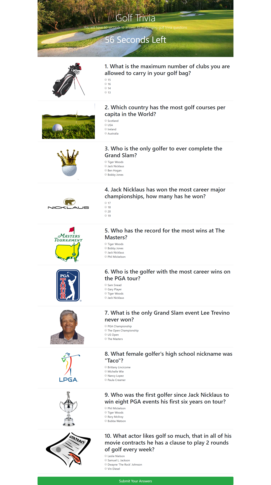
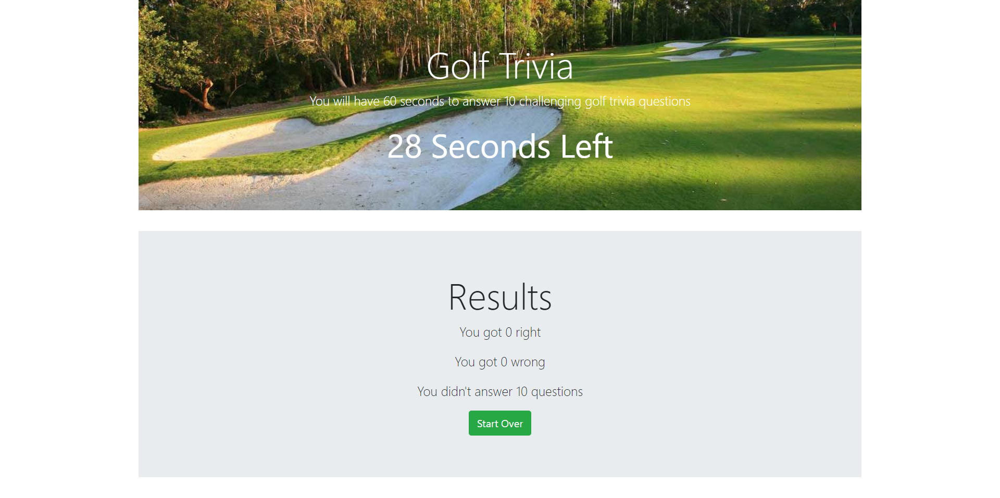

# Trivia-Game

### This was a homework assignment for the UCF Coding Boot Camp. In this assignment we were to use a combination of JavaScript and jQuery to create a trivia game. It was to include to include a timer function and have the ability to check the answers and return the results to the screen. 
---
## Screenshots
### Main Game

### Results

## Technologies Used
* HTML
* CSS
* JavaScript
* jQuery
* BootStrap

## Try the Golf Trivia Game
https://minneolamike.github.io/Trivia-Game/